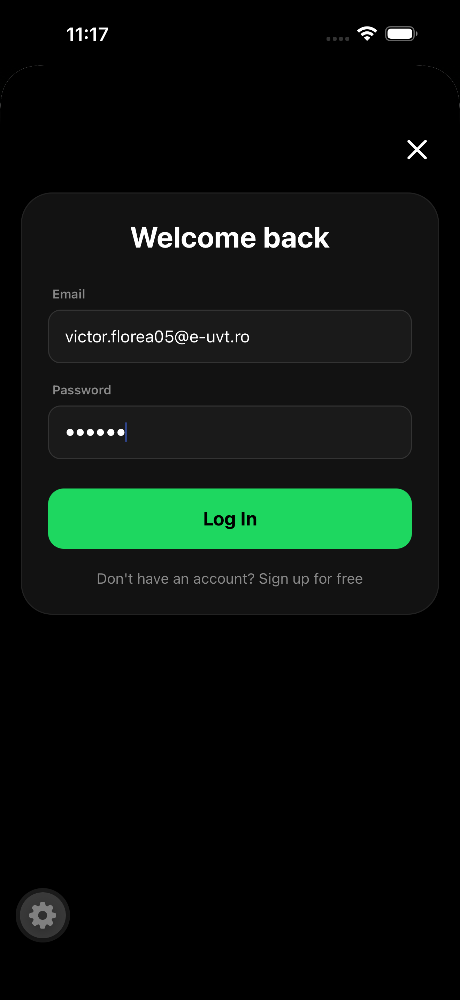
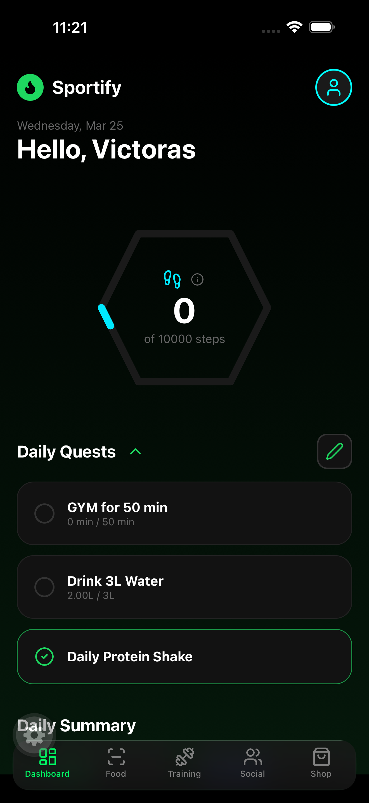
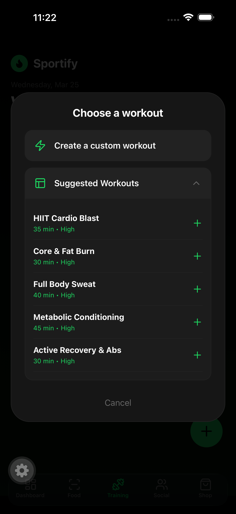
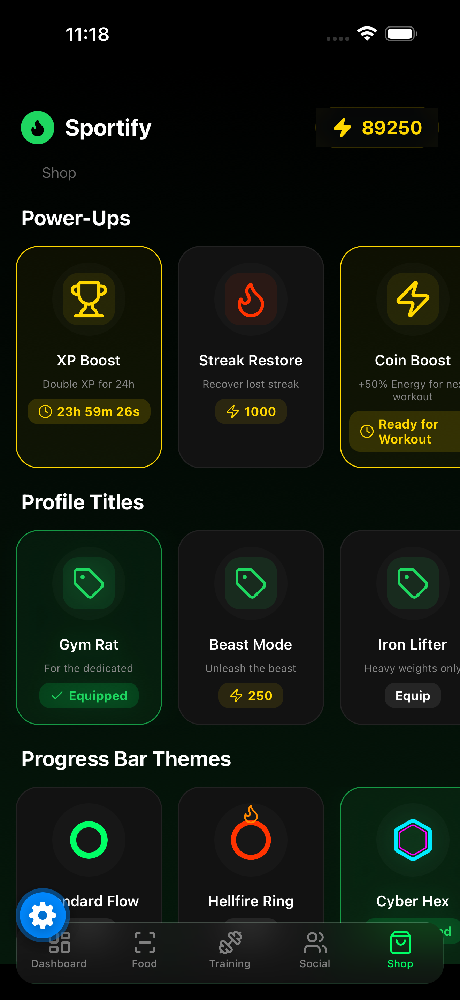
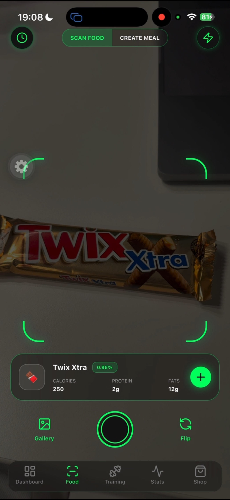

# Sportify

Sportify is a neon-style fitness companion that helps users track their daily activity, plan workouts, earn streaks/XP, and scan food for nutrition insights.

## Highlights
- **Workout tracking**: start/edit workouts, log sets (weight + reps), and finish with a rewarding summary.
- **Daily goals & tasks**: water / gym / custom tasks with auto-completion logic.
- **Stats & analytics**: weekly steps chart, total workouts, volume estimates, and “primary muscle group”.
- **Sensor integrations**:
  - **Pedometer** (daily steps) via `expo-sensors`
  - **Sleep** sync (iOS) via `react-native-health`
- **Food scanner**: camera/gallery capture + **OpenAI** generates structured nutrition info and meal suggestions.
- **Shop & power-ups**: spend energy points to equip cosmetic items and use gameplay boosts (XP boost, streak restore).

## Screens

### Auth


### Dashboard


### Workout


### Shop


### Scanner



## How It Works (High Level)
1. **Sign up / Log in**
   - Users authenticate with **Supabase Auth**.
   - A `profiles` row stores user stats like XP, energy points, and streaks.
2. **Daily tracking**
   - **Steps** are updated live from the device pedometer and saved to `daily_steps`.
   - **Sleep** (iOS) is read from Apple Health and saved to `daily_stats`.
   - **Water/tasks** update `daily_stats` and drive XP rewards when goals are reached.
3. **Workouts**
   - While running a workout, the user marks sets as completed.
   - When finishing:
     - volume is computed from **weight x reps**
     - `daily_stats.activity_minutes` and `workout_completions` are updated
     - **streak + XP** are updated in `profiles`
     - the summary modal shows totals + a random motivational message
4. **Food scanning**
   - The app captures an image using **Camera** or **Image Picker**.
   - It sends the image (base64) to **OpenAI** asking for strict JSON output.
   - Results are parsed and shown, then saved to `scanned_foods` for later calorie totals.

## Tech Stack
- **Frontend**: React Native + Expo
- **UI/UX**: gradients, blur surfaces, neon gamification
- **Backend**: Supabase (Auth + Postgres)
- **Sensors / Integrations**:
  - `expo-sensors` (Pedometer)
  - `react-native-health` (Apple Sleep, iOS)
  - OpenAI API (structured JSON generation)

## Setup
### Prerequisites
- Node.js + npm
- Expo tooling (`npm install -g expo-cli` is optional depending on your workflow)
- A Supabase project
- An OpenAI API key

### Environment Variables
This project reads the OpenAI key from:
- `EXPO_PUBLIC_OPENAI_API_KEY` (used in `ScannerScreen.js`)

Example `.env` file (in the project root):
```bash
EXPO_PUBLIC_OPENAI_API_KEY="your_openai_key_here"
```

> Note: Supabase URL/Anon key are currently hardcoded in `src/lib/supabase.js`. For production, consider moving them to environment variables.

## Run Locally
```bash
npm install
npm start
```

Use the Expo client to open the app (or run `expo run:ios` / `expo run:android`).

## Data Model (Main Tables)
The app reads/writes to:
- `profiles` (XP, energy points, streaks, equipped items)
- `daily_stats` (activity minutes, water ml, sleep minutes)
- `daily_steps` (step counts per day)
- `tasks` (daily tasks)
- `workout_completions` (workout history)
- `user_workouts` (current workout being edited/played)
- `user_inventory` (owned/equipped shop items)
- `scanned_foods` (food scan history)

## License
Add your preferred license here (or remove this section if not needed).
